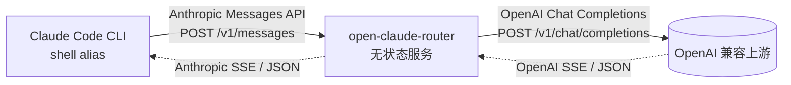

# open-claude-router

> 把任意 OpenAI 兼容上游"包装成" Anthropic Messages API，让 [Claude Code](https://docs.anthropic.com/claude/docs/claude-code) 能直接使用。

一个**完全无状态**的协议转换服务：不读本地配置、不存任何凭证、不维护 provider 列表。所有上游信息（URL、Authorization、模型名）由请求方逐请求传过来，因此一份部署可以服务任意客户端、任意上游。

## 特性

- **零配置**：服务侧不存任何 API Key，所有信息由客户端逐请求传入
- **任意 Authorization 格式**：标准 `Bearer sk-...`、企业网关常见的非 Bearer 自定义协议头都能原样透传
- **完整覆盖 Claude Code 协议**：流式 SSE、工具调用（`tool_use` / `tool_result` 双向增量）、多模态图片、prompt cache 字段、`thinking` 块
- **两种接入方式**：上游信息可以放 HTTP header，也可以直接拼在 URL path 里

## 快速开始

### 1. 启动服务

本地：

```bash
npm install
npm run dev          # 默认监听 :3457
```

Docker：

```bash
docker build -t open-claude-router .
docker run -d -p 3457:3457 --name ocr open-claude-router
```

### 2. 配置 Claude Code alias

#### 方式 A：URL path 内嵌上游（最简洁，单行 alias）

把上游完整 URL 直接拼在服务地址后面：

```bash
alias myocr="ANTHROPIC_BASE_URL=http://localhost:3457/https://api.openai.com/v1/chat/completions \
ANTHROPIC_AUTH_TOKEN='Bearer sk-proj-xxxxx' \
ANTHROPIC_MODEL=gpt-4o \
ANTHROPIC_DEFAULT_SONNET_MODEL=gpt-4o \
ANTHROPIC_DEFAULT_OPUS_MODEL=gpt-4o \
ANTHROPIC_DEFAULT_HAIKU_MODEL=gpt-4o-mini \
claude"
```

> **重要**：`ANTHROPIC_AUTH_TOKEN` 应填**上游需要的完整 Authorization header 值**（Claude Code 客户端会自动加 `Bearer ` 前缀，服务在 path 模式下会剥掉这一层后透传给上游）。
>
> - 上游期望 Bearer 鉴权（OpenAI 等）：写 `'Bearer sk-...'`
> - 上游期望非 Bearer 自定义协议头：写 `'custom-scheme://...?key=...'`

#### 方式 B：自定义 header 传上游（更灵活，支持服务自身鉴权）

```bash
alias myocr="ANTHROPIC_BASE_URL=http://localhost:3457 \
ANTHROPIC_AUTH_TOKEN=service-access-token \
ANTHROPIC_CUSTOM_HEADERS=$'X-Upstream-Url: https://api.openai.com/v1/chat/completions\nX-Upstream-Authorization: Bearer sk-proj-xxxxx\nX-Upstream-Model: gpt-4o' \
ANTHROPIC_MODEL=gpt-4o \
ANTHROPIC_DEFAULT_SONNET_MODEL=gpt-4o \
claude"
```

> 服务自身鉴权与上游凭证完全分离；可配合环境变量 `OCR_ACCESS_TOKENS=token1,token2,...` 启用服务侧 Bearer 白名单（仅 header 模式生效）。

### 3. 启动 Claude Code

```bash
myocr
```

正常对话、工具调用、`/model` 切换都会被透明转换。`ANTHROPIC_DEFAULT_*_MODEL` 各自对应不同场景（默认 / `/model sonnet` / `/model opus` / 后台 haiku 任务），上游收到的 model 字段就是当前场景对应的那个，可以填不同模型名分场景路由。

## 架构



服务收到 Anthropic 协议的请求后：

1. 从 HTTP header 或 URL path 解析出真实上游 URL 和 Authorization
2. 把 Anthropic 请求体转换成 OpenAI Chat Completions 请求体
3. 用客户端给的凭证调用上游
4. 把上游响应（SSE 流或 JSON）转回 Anthropic 格式返回 Claude Code

整个过程不读本地配置、不存任何凭证、不维护 provider 表，因此服务**无状态、可任意水平扩展**。

## API

| Method | Path | 说明 |
|---|---|---|
| `POST` | `/v1/messages` | 主聊天端点（header 模式） |
| `POST` | `/v1/messages/count_tokens` | token 数量本地估算（header 模式） |
| `POST` | `/<完整上游 URL>/v1/messages` | path 模式聊天端点 |
| `POST` | `/<完整上游 URL>/v1/messages/count_tokens` | path 模式 token 估算 |
| `GET`  | `/healthz` | 健康检查 |

### Header 模式必需的请求头

| Header | 说明 |
|---|---|
| `X-Upstream-Url` | 完整上游 URL（含 `/chat/completions` 路径） |
| `X-Upstream-Authorization` | 上游 Authorization 原值（原样透传，支持任意格式） |
| `X-Upstream-Model` | （可选）真实上游模型名；提供则覆盖 body 里的 `model` |
| `Authorization: Bearer <token>` | （可选）服务自身访问鉴权，仅在设置 `OCR_ACCESS_TOKENS` 时校验 |

### Path 模式

把上游完整 URL 直接拼在服务地址后面，例如：

```
http://localhost:3457/https://api.openai.com/v1/chat/completions
```

Claude Code 会自动追加 `/v1/messages`，服务端识别并砍掉这个后缀，剩下的就是上游 URL。上游 Authorization 走标准 `Authorization: Bearer ...` header，服务端剥 `Bearer ` 前缀后原样透传上游。

## 环境变量

| 变量 | 默认值 | 说明 |
|---|---|---|
| `PORT` | `3457` | 监听端口 |
| `HOST` | `0.0.0.0` | 监听地址 |
| `LOG_LEVEL` | `info` | Pino 日志级别（`trace` / `debug` / `info` / `warn`） |
| `OCR_ACCESS_TOKENS` | unset | 逗号分隔的 Bearer token 白名单；不设则关闭服务自身鉴权（仅 header 模式生效） |

## 安全

- 这是**透明转发**服务：上游凭证经服务转发，**务必走 HTTPS**
- 公网部署强烈建议设置 `OCR_ACCESS_TOKENS` 防止扫描滥用
- 日志默认脱敏 `authorization` / `x-upstream-authorization` / `x-api-key`（Pino `redact`）
- 不要把上游凭证写入版本控制的文件，用 `~/.zshrc` 或 1Password CLI 等工具按需注入

## License

MIT
