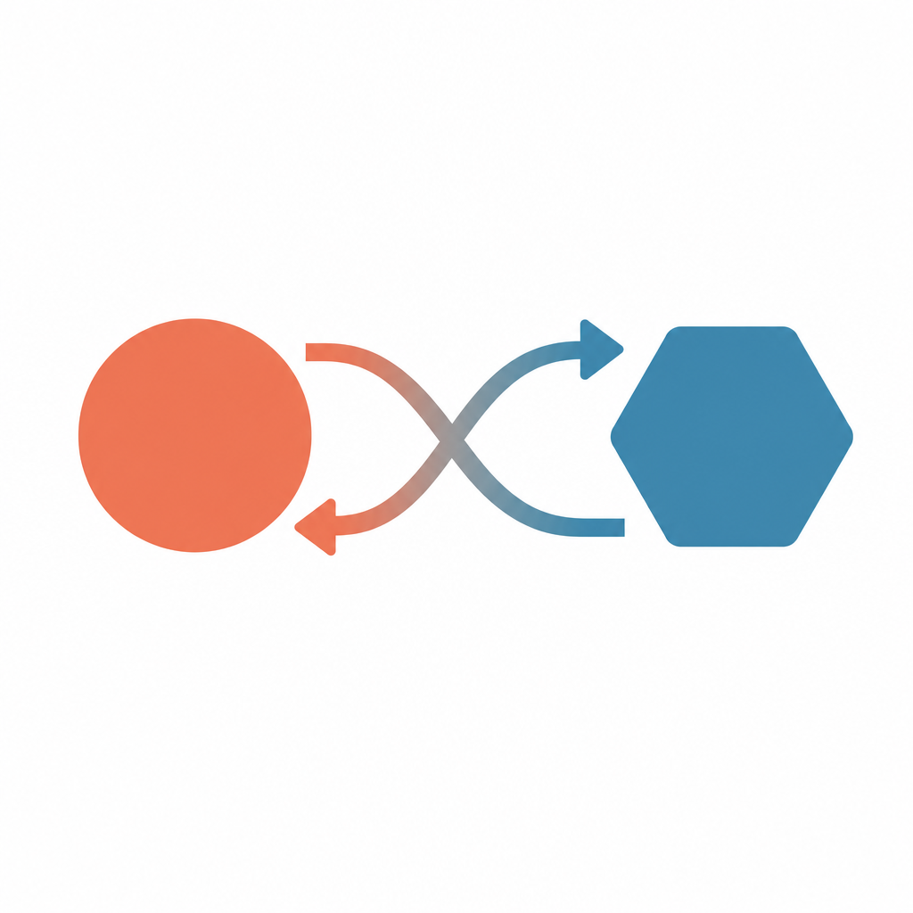
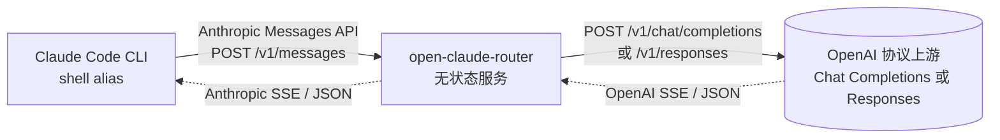

<p align="center">
  
</p>

<h1 align="center">open-claude-router</h1>

<p align="center">
  把任意 OpenAI 兼容上游"包装成" Anthropic Messages API，让 <a href="https://docs.anthropic.com/claude/docs/claude-code">Claude Code</a> 能直接使用。
</p>

<p align="center">
  <a href="https://nodejs.org/"></a>
  <a href="https://hub.docker.com/r/riba2534/open-claude-router"></a>
  <a href="https://github.com/riba2534/open-claude-router/stargazers"></a>
  <a href="https://github.com/riba2534/open-claude-router/blob/main/LICENSE"></a>
</p>

---

## 这是什么

一个**完全无状态**的协议转换服务：不读本地配置、不存任何凭证、不维护 provider 列表。所有上游信息（URL、Authorization、模型名）由请求方逐请求传过来，因此一份部署可以服务任意客户端、任意上游。

把它部署一次，全公司同事改改 shell alias 就能用上各家 OpenAI 兼容的大模型 API；不需要每个人本地装路由器、不需要服务端维护一份 provider 列表，**配置完全留在客户端**。

## 特性

- **零配置**：服务侧不存任何 API Key，所有信息由客户端逐请求传入
- **任意 Authorization 格式**：标准 `Bearer sk-...`、企业网关常见的非 Bearer 自定义协议头都能原样透传
- **完整覆盖 Claude Code 协议**：流式 SSE、工具调用（`tool_use` / `tool_result` 双向增量）、多模态图片、`thinking` 块
- **同时支持 OpenAI 两套协议**：默认走 Chat Completions（兼容字节 AI Gateway / OpenRouter / Kimi / DeepSeek 等所有第三方上游），通过 `X-Upstream-Format: responses` opt-in 切到 Responses API（OpenAI o-series / gpt-5 原生协议，含 reasoning summary 转 Anthropic `thinking` 块）
- **两种接入方式**：上游信息可以放 HTTP header，也可以直接拼在 URL path 里
- **轻量好部署**：esbuild 打包后单文件 ~70 KB，Docker 镜像几十 MB，开箱即用

## 架构



服务收到 Anthropic 协议的请求后，从 HTTP header 或 URL path 解析出真实上游 URL 和 Authorization，把请求体转成对应的 OpenAI 协议（默认 Chat Completions，可通过 `X-Upstream-Format: responses` 切到 Responses API）调用上游，再把上游响应（SSE 流或 JSON）转回 Anthropic 格式返回。整个过程不读本地配置、不存任何凭证、不维护 provider 表，因此**无状态、可任意水平扩展**。

## 快速开始

### 1. 启动服务

推荐用 Docker 一键启动（镜像在 [Dockerhub](https://hub.docker.com/r/riba2534/open-claude-router)，amd64 + arm64 双架构）：

```bash
docker run -d --name ocr --restart unless-stopped -p 3457:3457 \
  riba2534/open-claude-router:latest
```

服务监听 `:3457`，零配置即可使用。公网部署可加 `-e OCR_ACCESS_TOKENS=token1,token2` 启用访问鉴权。

<details>
<summary>开发者：自己构建 / 用 npm 跑</summary>

```bash
# 自己构建镜像
docker build -t open-claude-router .
docker run -d --name ocr --restart unless-stopped -p 3457:3457 open-claude-router

# 或直接用 npm 跑（tsx watch 模式）
npm install
npm run dev
```
</details>

### 2. 配置 Claude Code alias

#### 方式 A：URL path 内嵌上游（最简洁）

把上游完整 URL 直接拼在服务地址后面：

```bash
alias myocr="ANTHROPIC_BASE_URL=http://localhost:3457/https://api.openai.com/v1/chat/completions \
ANTHROPIC_AUTH_TOKEN='Bearer sk-proj-xxxxx' \
ANTHROPIC_MODEL=gpt-5.5 \
ANTHROPIC_DEFAULT_SONNET_MODEL=gpt-5.5 \
ANTHROPIC_DEFAULT_OPUS_MODEL=gpt-5.5 \
ANTHROPIC_DEFAULT_HAIKU_MODEL=gpt-5.5-mini \
claude"
```

> **`ANTHROPIC_AUTH_TOKEN` 应填上游需要的完整 Authorization header 值。** Claude Code 客户端会自动加 `Bearer ` 前缀，服务在 path 模式下会剥掉这一层后透传给上游：
>
> - 上游期望 Bearer 鉴权（OpenAI 等）→ 写 `'Bearer sk-...'`
> - 上游期望非 Bearer 自定义协议头 → 写 `'custom-scheme://...?key=...'`

如果服务端启用了 `OCR_ACCESS_TOKENS` 白名单（公网部署强烈建议），path 模式下 `Authorization` 已经被上游凭证占用，需要额外通过 `ANTHROPIC_CUSTOM_HEADERS` 传 `X-OCR-Token` 做服务侧鉴权：

```bash
alias myocr="ANTHROPIC_BASE_URL=http://your-bridge.example.com/https://api.openai.com/v1/chat/completions \
ANTHROPIC_AUTH_TOKEN='Bearer sk-proj-xxxxx' \
ANTHROPIC_CUSTOM_HEADERS='X-OCR-Token: mytoken1' \
ANTHROPIC_MODEL=gpt-5.5 \
... \
claude"
```

#### 方式 B：自定义 header 传上游（更灵活，支持服务自身鉴权）

```bash
alias myocr="ANTHROPIC_BASE_URL=http://localhost:3457 \
ANTHROPIC_AUTH_TOKEN=service-access-token \
ANTHROPIC_CUSTOM_HEADERS=$'X-Upstream-Url: https://api.openai.com/v1/chat/completions\nX-Upstream-Authorization: Bearer sk-proj-xxxxx\nX-Upstream-Model: gpt-5.5' \
ANTHROPIC_MODEL=gpt-5.5 \
ANTHROPIC_DEFAULT_SONNET_MODEL=gpt-5.5 \
ANTHROPIC_DEFAULT_OPUS_MODEL=gpt-5.5 \
ANTHROPIC_DEFAULT_HAIKU_MODEL=gpt-5.5-mini \
claude"
```

> 服务自身鉴权与上游凭证完全分离；可配合环境变量 `OCR_ACCESS_TOKENS=token1,token2,...` 启用服务侧 Bearer 白名单（header 模式校验 `Authorization: Bearer ...`，path 模式校验 `X-OCR-Token`）。

#### 方式 C：接 OpenAI Responses API（o3 / gpt-5 等原生 reasoning 模型）

OpenAI 在 2025 年推出 **Responses API**（`/v1/responses`），是 o-series / gpt-5 的原生协议，含 reasoning summary。把方式 A 的 alias 多加一个 `X-Upstream-Format: responses` header 即可——其他保持不变：

```bash
alias myo3="ANTHROPIC_BASE_URL=http://localhost:3457/https://api.openai.com/v1/responses \
ANTHROPIC_AUTH_TOKEN='Bearer sk-proj-xxxxx' \
ANTHROPIC_CUSTOM_HEADERS='X-Upstream-Format: responses' \
ANTHROPIC_MODEL=o3 \
ANTHROPIC_DEFAULT_SONNET_MODEL=o3 \
ANTHROPIC_DEFAULT_OPUS_MODEL=o3 \
ANTHROPIC_DEFAULT_HAIKU_MODEL=o3-mini \
claude"
```

服务侧会把 OpenAI 的 `response.reasoning_summary_text.delta` 等事件转成 Anthropic 的 `thinking` 块返回给 Claude Code。**其他所有 alias（不带 `X-Upstream-Format` 或显式 `chat-completions`）行为完全不变**。

### 3. 启动 Claude Code

```bash
myocr
```

正常对话、工具调用、`/model` 切换都会被透明转换。`ANTHROPIC_DEFAULT_*_MODEL` 各自对应不同场景（默认 / `/model sonnet` / `/model opus` / 后台 haiku 任务），上游收到的 model 字段就是当前场景对应的那个，可以填不同模型名分场景路由。

## 协议覆盖与边界

| 能力 | 默认（Chat Completions） | Responses API |
|---|---|---|
| 文本流式 SSE | ✅ 完整 | ✅ 完整 |
| 工具调用（`tool_use` / `tool_result` 双向增量） | ✅ 完整 | ✅ 完整 |
| 多模态图片（`image` content block） | ✅ 完整 | ✅ 完整 |
| `/model sonnet` / `opus` / haiku 切换 | ✅ body.model 字段透传 | ✅ 同 |
| 客户端中断（Ctrl+C） | ✅ AbortSignal 传到上游 | ✅ 同 |
| `thinking` 块 | ⚠️ 字段会被剥（绝大多数 Chat Completions 上游不识别） | ✅ 上游 reasoning summary 自动转 Anthropic `thinking` |
| Prompt cache（`cache_control`） | ⚠️ 字段会被剥（避免严格上游 400），返回不会有 `cache_read_input_tokens` | 同左 |
| `count_tokens` 端点 | ⚠️ 服务本地 `js-tiktoken` 粗略估算（非上游精确值） | 同左 |

## API

| Method | Path | 说明 |
|---|---|---|
| `POST` | `/v1/messages` | 主聊天端点（header 模式） |
| `POST` | `/v1/messages/count_tokens` | token 数量本地估算（header 模式） |
| `POST` | `/<完整上游 URL>/v1/messages` | path 模式聊天端点 |
| `POST` | `/<完整上游 URL>/v1/messages/count_tokens` | path 模式 token 估算 |
| `GET`  | `/healthz` | 健康检查 |

### 请求头

| Header | 适用模式 | 必需性 | 说明 |
|---|---|---|---|
| `X-Upstream-Url` | header | ✅ 必需 | 完整上游 URL（含 `/chat/completions` 或 `/responses` 路径） |
| `X-Upstream-Authorization` | header | ✅ 必需 | 上游 Authorization 原值（原样透传，支持任意格式） |
| `X-Upstream-Model` | header | 可选 | 真实上游模型名；提供则覆盖 body 里的 `model` |
| `Authorization: Bearer <token>` | header | 仅 `OCR_ACCESS_TOKENS` 启用时校验 | 服务自身访问鉴权 |
| `X-OCR-Token` | path | 仅 `OCR_ACCESS_TOKENS` 启用时校验 | path 模式下 `Authorization` 被上游凭证占用，服务鉴权改走此 header |
| `X-Upstream-Format` | 两种模式都可用 | 可选 | `chat-completions`（默认）或 `responses`，声明上游 OpenAI 协议变体 |

### Path 模式

把上游完整 URL 直接拼在服务地址后面，例如：

```
http://localhost:3457/https://api.openai.com/v1/chat/completions
```

Claude Code 会自动追加 `/v1/messages`，服务端识别并砍掉这个后缀，剩下的就是上游 URL。上游 Authorization 走标准 `Authorization: Bearer ...` header，服务端剥 `Bearer ` 前缀后原样透传上游。

## 环境变量

| 变量 | 默认值 | 说明 |
|---|---|---|
| `PORT` | `3457` | 监听端口 |
| `HOST` | `0.0.0.0` | 监听地址 |
| `LOG_LEVEL` | `info` | Pino 日志级别（`trace` / `debug` / `info` / `warn`） |
| `OCR_ACCESS_TOKENS` | unset | 逗号分隔的访问 token 白名单；不设则关闭服务自身鉴权。header 模式校验 `Authorization: Bearer ...`，path 模式校验 `X-OCR-Token` header |

## 安全

- 这是**透明转发**服务：上游凭证经服务转发，**务必走 HTTPS**
- 公网部署强烈建议设置 `OCR_ACCESS_TOKENS` 防止扫描滥用
- 日志默认脱敏 `authorization` / `x-upstream-authorization` / `x-api-key`（Pino `redact`）
- 不要把上游凭证写入版本控制的文件，用 `~/.zshrc` 或 1Password CLI 等工具按需注入

## Star History

<a href="https://star-history.com/#riba2534/open-claude-router&Date">
  <picture>
    <source media="(prefers-color-scheme: dark)" srcset="https://api.star-history.com/svg?repos=riba2534/open-claude-router&type=Date&theme=dark" />
    <source media="(prefers-color-scheme: light)" srcset="https://api.star-history.com/svg?repos=riba2534/open-claude-router&type=Date" />
    
  </picture>
</a>

## License

MIT
